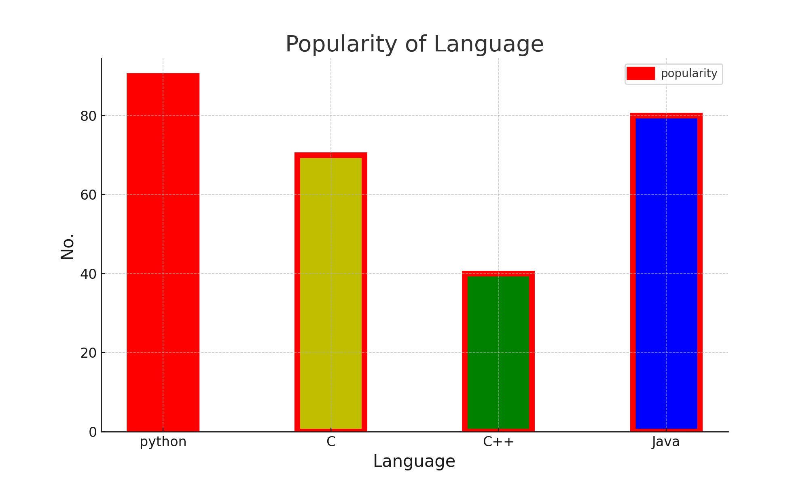
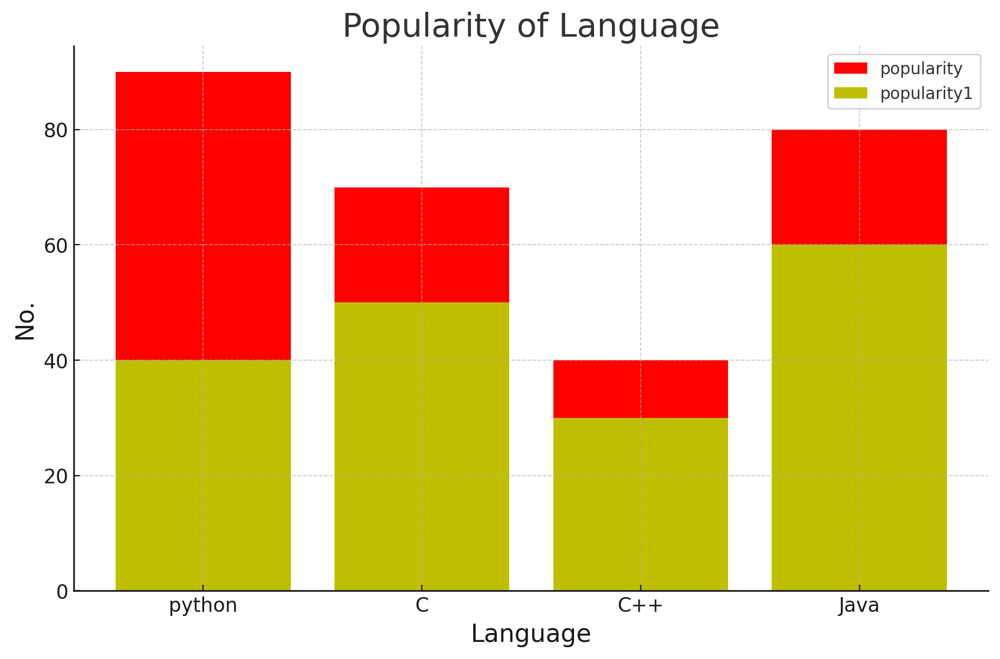

# Bar Plot using Matplotlib

## Introduction

This guide demonstrates how to create a bar plot using Matplotlib. Bar plots are used to represent categorical data with rectangular bars where the length of each bar is proportional to the value it represents.

---

## Code Explanation

Here is the code to create a bar plot:

```python
import matplotlib.pyplot as plt

# Data for the bar plot
x = ["python", "C", "C++", "Java"]
y = [90, 70, 40, 80]
c = ['r', 'y', 'g', 'b']

# Creating the bar plot
plt.bar(x, y, color=c, width=0.4, edgecolor='r', linewidth=5, alpha=1, label="popularity")

# Adding labels, title, and legend
plt.xlabel("Language", fontsize=15)
plt.ylabel("No.", fontsize=15)
plt.title("Popularity of Language", fontsize=20)
plt.legend()

# Displaying the plot
plt.show()
```

### Key Points:
- **`plt.bar(x, y, ...)`**: Creates a bar plot where `x` represents the categories and `y` represents the values.
- **Colors and Styling**: The bars are styled with specific colors (`c`), edge color, and line width.
- **Labels and Title**: Axis labels and the plot title are added using `plt.xlabel()`, `plt.ylabel()`, and `plt.title()`.
- **Legend**: A legend is added with `plt.legend()` to describe the data.

---

## Output

Below is the generated bar plot:



---

## Notes
- Ensure Matplotlib is installed in your environment using:

  ```bash
  pip install matplotlib
  ```

- You can modify the data (`x` and `y`) to create bar plots for other datasets.

---

### Bar Plot Example: Overlapping Bar Charts in Python

---

#### Objective:
This README will guide you through the process of creating two overlapping bar plots in Python using `matplotlib`. The code will show how two bar plots can be displayed on the same chart, effectively overlapping, using different colors and labels.

---

#### Code:

```python
import matplotlib.pyplot as plt

x = ["Python", "C", "C++", "Java"]
y = [90, 70, 40, 80]
z = [40, 50, 30, 60]
c = ['r', 'y', 'g', 'b']

plt.bar(x, y, color='r', label="popularity")
plt.bar(x, z, color='y', label="popularity1")

plt.xlabel("Language", fontsize=15)
plt.ylabel("No.", fontsize=15)
plt.title("Popularity of Language", fontsize=20)
plt.legend()
plt.show()
```

---

#### Explanation:

1. **`x` and `y`**: 
   - `x` contains the labels ("Python", "C", "C++", "Java").
   - `y` contains the values for the first bar plot (`popularity`).

2. **`z` and `c`**:
   - `z` contains the values for the second bar plot (`popularity1`).
   - `c` contains colors corresponding to each language.

3. **`plt.bar()`**: 
   - Two `bar()` functions are used here.
   - The first `bar()` creates bars for `y`, with the color red (`'r'`) and label "popularity."
   - The second `bar()` creates bars for `z`, with the color yellow (`'y'`) and label "popularity1."

4. **`plt.xlabel()`, `plt.ylabel()`, `plt.title()`**:
   - These functions are used to label the axes and title the plot.
   - `fontsize` adjusts the size of the text.

5. **`plt.legend()`**:
   - Adds a legend to show what each color represents.

---

#### Picture:

The following image illustrates the result of this code where two overlapping bar plots are created.



---

#### Instructions:

- Save the code into a Python file, for example, `bar_plot_overlapping.py`.
- Run the file using Python. 
- The plot will display, showing the overlapping bars.
- The image generated by running this code is saved as `bar_plot_example.png`.

---

This basic guide explains how to create overlapping bar charts with `matplotlib`. Adjust the data and colors as needed to fit your requirements.

---
